```{r setup, include=FALSE}
knitr::opts_chunk$set(echo = TRUE)
```

## Eyrie Reef pre/post bleaching (Dec 2023 vs Mar 2024)

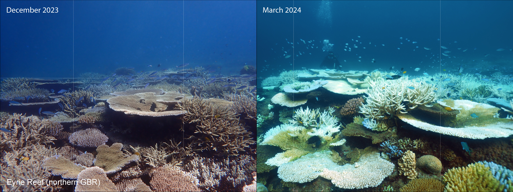

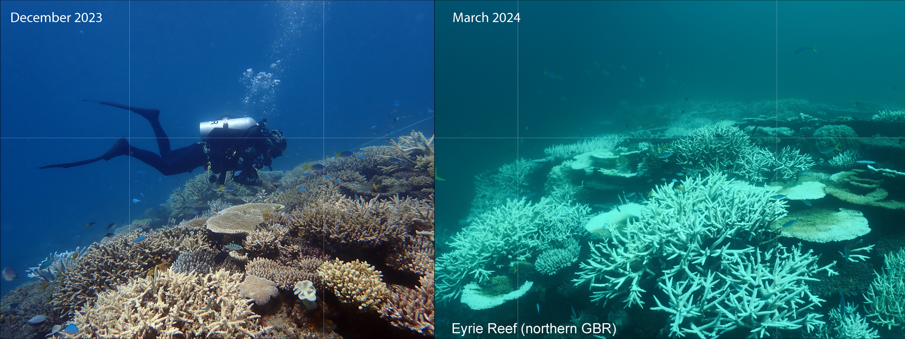

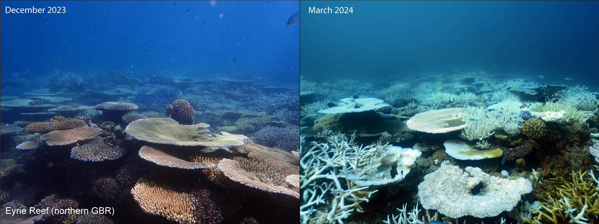

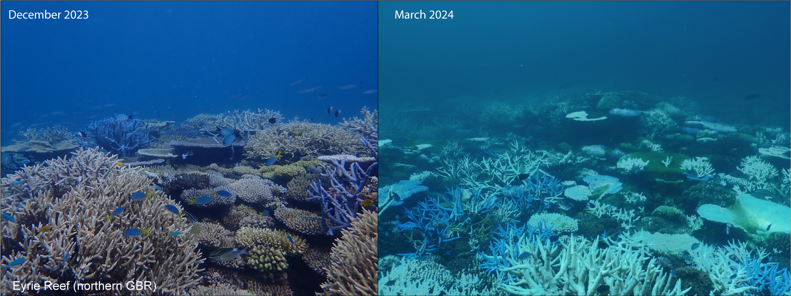

## Aerial images (16th-20th March 2024)

North Point

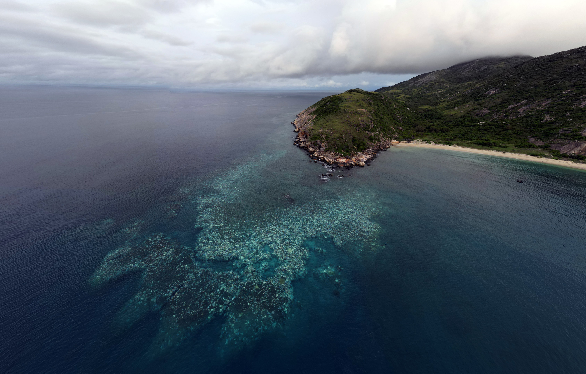

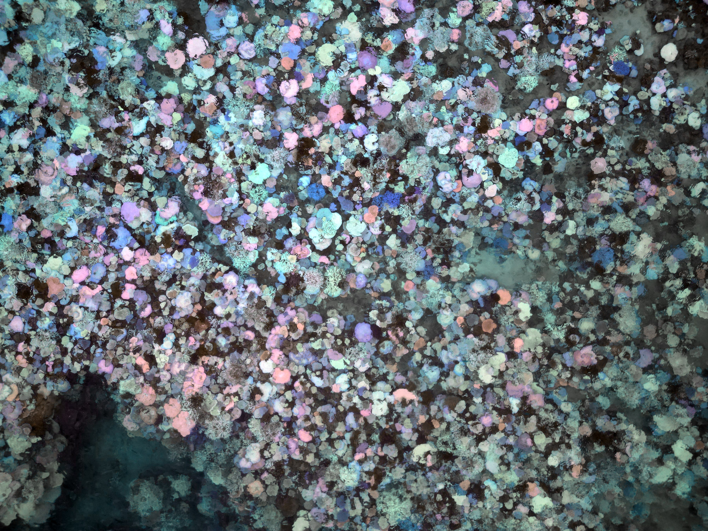

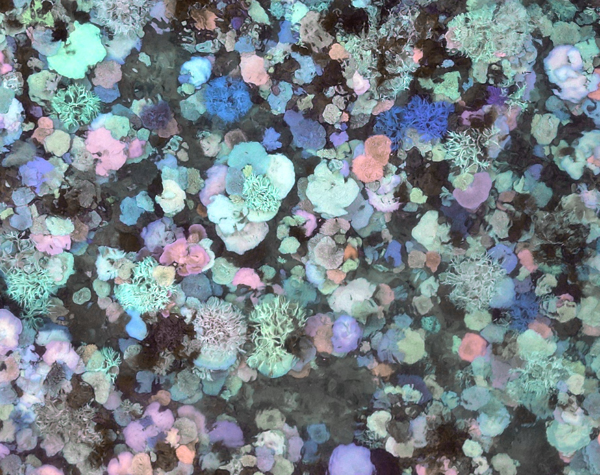

Palfrey Island - South Island


## Eyrie Reef (16th March 2024)


## Lizard Island, Watson's Bay (19th March 2024)

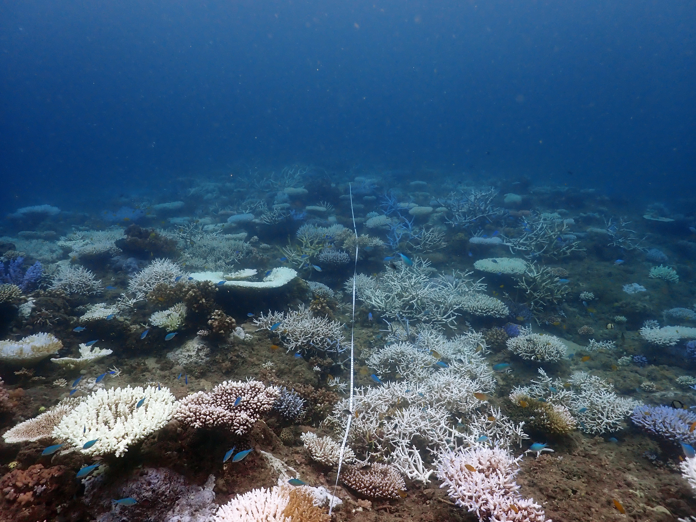

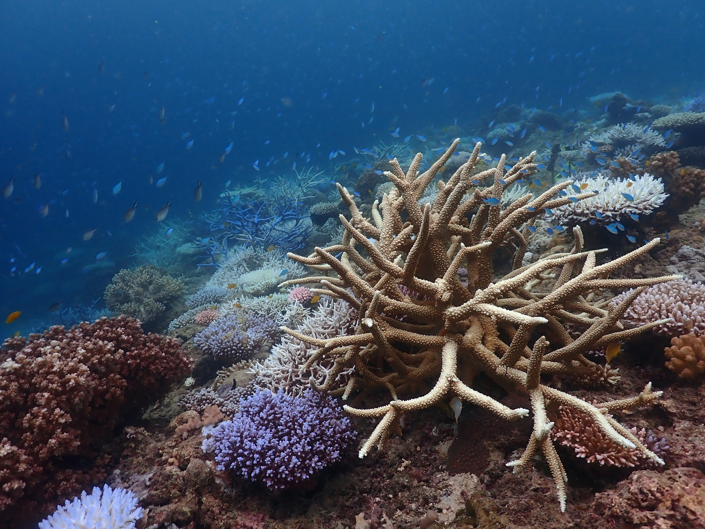

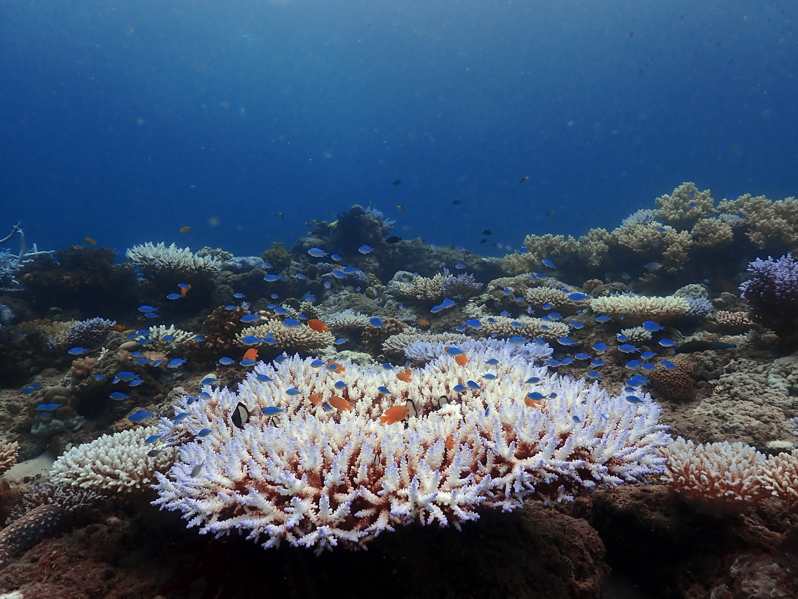

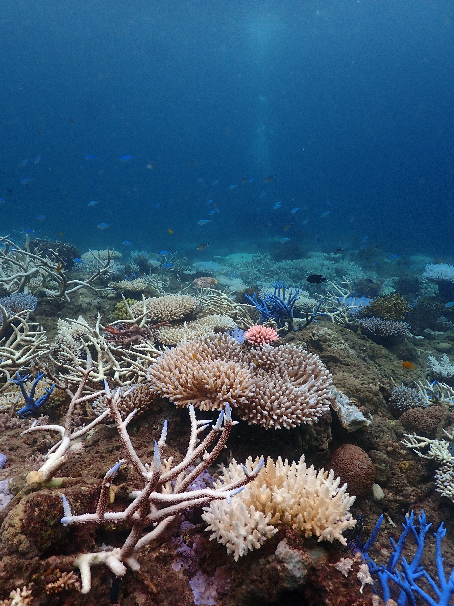

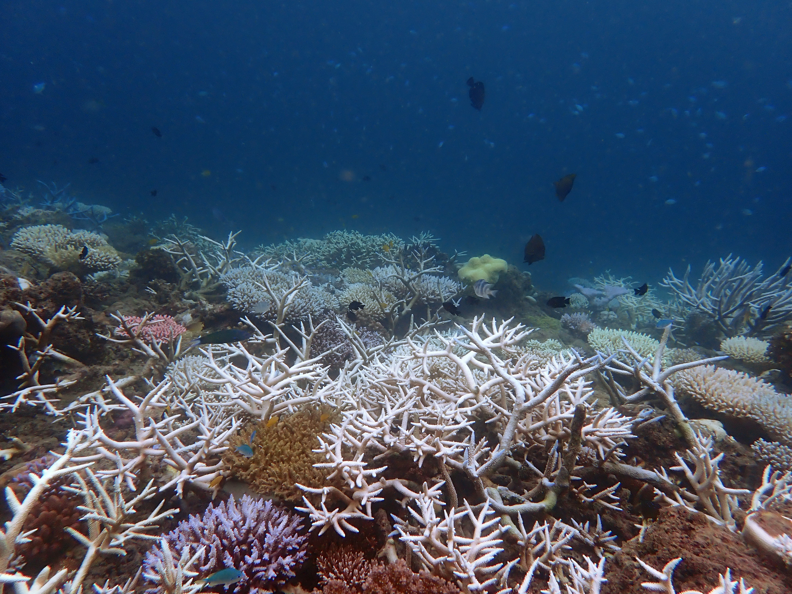
